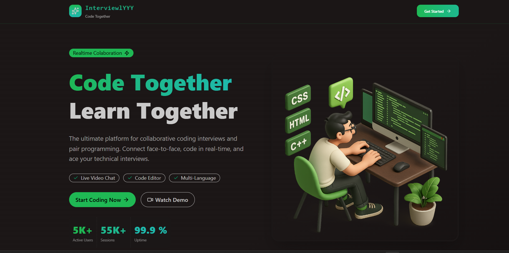
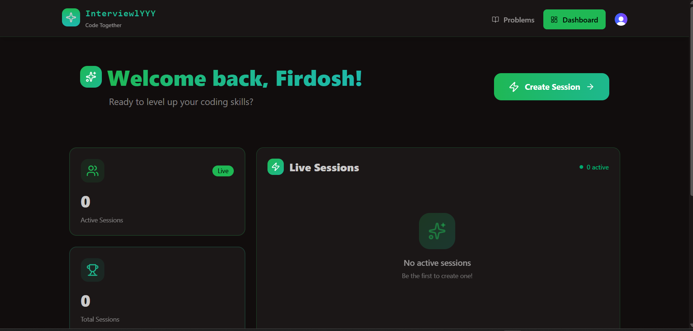
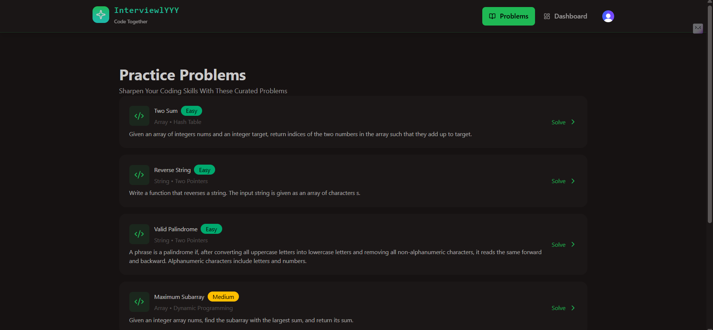
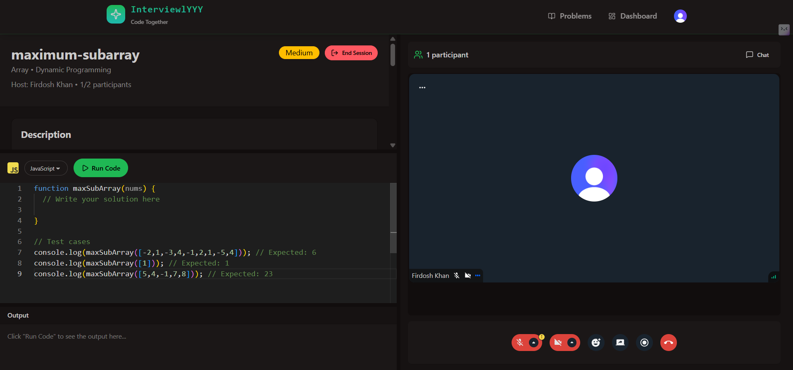

# Interviewlyy

Interviewlyy is a full stack interview practice platform built to simulate real technical interviews.  
The focus of this project is real world architecture, production level behavior, and hands on learning instead of tutorial based demos.

---

## What is Interviewlyy

Interviewlyy allows users to practice coding problems, create live interview sessions, and communicate in real time using video, chat, and screen sharing.  
It is designed to feel close to an actual technical interview environment.

---

## Key Features

### Authentication and User Management
- Secure signup and login using Clerk  
- Protected routes for authenticated users  
- Automatic user sync from Clerk to MongoDB using background jobs  

### Coding Practice Dashboard
- VS Code like coding experience using Monaco Editor  
- Solve coding problems directly in the browser  
- Multiple language support  
  - JavaScript  
  - Python  
  - Java  
- Code execution handled by Piston API  

### Interview Sessions
- Create interview sessions as a host  
- Join sessions as a participant after login  
- Maximum of two participants per session  
- Only the host can cancel the session  

### Real Time Communication
- 1 on 1 video interview calls using Stream  
- Screen sharing support  
- Live chat messaging during sessions  
- Seamless real time experience  

### State Management and Data Fetching
- TanStack Query used in React  
- Efficient backend data fetching and caching  
- Automatic background refetching and sync  

### Background Jobs
- Inngest used for background tasks  
- Sync user data from Clerk to MongoDB  
- Non blocking async processing  

---

## Upcoming Advanced Features
- Live collaborative coding where host and participant can code together  
- Join interview sessions using email invitation links  
- Improved role based access control  

---

## Tech Stack

### Frontend
- React  
- TanStack Query  
- Monaco Editor  

### Backend
- Node.js  
- Express  

### Database
- MongoDB  

### Authentication
- Clerk  

### Real Time Communication
- Stream Video  
- Stream Chat  

### Code Execution
- Piston API  

### Background Jobs
- Inngest  

### Deployment
- Render  

---

## Screenshots

### Home Page

### Dashboard

### Problems Page

### Interview Session Page

---

## Production Issue and Learning

One major challenge faced during development was that the application worked perfectly in local development but failed in production.

The issue was related to environment variables and CORS configuration not being properly set in the production environment.  
After debugging and fixing these issues, the application ran successfully in production.

This helped in understanding the difference between local and production environments and the importance of correct configuration.

---

## Project Goals
- Learn by building real world features  
- Understand production level behavior  
- Improve system design and debugging skills  
- Build confidence in full stack development  

---

## How to Run Locally

1. Clone the repository  
2. Install dependencies for frontend and backend  
3. Set up environment variables  
4. Run backend server  
5. Run frontend application  

---

## Author
Firdosh Khan  

---

## Future Improvements
- Better scalability  
- More problem sets  
- Enhanced interview analytics  
- Improved UI and UX  
